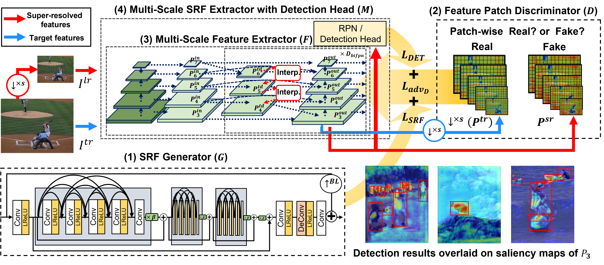
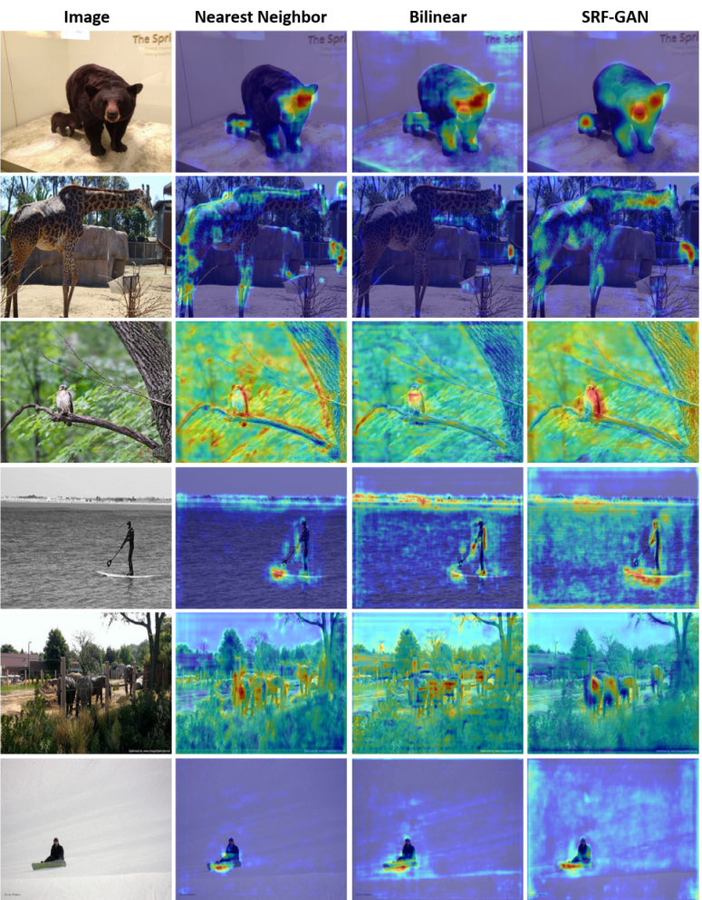

## [Multi-Scale Representation via Adversarial Super-Resolved Feature Learning for Object Detection](https://github.com/inhavl-shlee/SRF-GAN)

A novel generator for super-resolving features of the object detection and instance segmentation.

This is the code for our papers and implemented based on [detectron2](https://github.com/facebookresearch/detectron2).



## Abstract

Recent convolutional  object detectors exploit multi-scale feature representations added with  top-down pathway in order to detect objects at different scales and learn stronger semantic feature responses.
In general, during the top-down feature propagation, coarser feature maps are upsampled to be combined with the  features forwarded from bottom-up pathway, and the combined stronger semantic features are inputs of detector's headers. However,  simple interpolation methods  (*e.g.* nearest neighbor and bilinear) are still used for increasing feature resolutions although  they often incur noisy and blurred features.
In this paper, we propose a novel super-resolved feature (SRF) generator which can substitute for the traditional interpolation effortlessly. In specific, we first design super-resolved feature GAN (SRF-GAN) consisting of a SRF generator and a feature patch discriminator. In addition, we present SRF-GAN losses for generating the high quality of super-resolved features and improving detection accuracy together and train a SRF generator by minimizing the discrepancy between super-resolved and target features and the losses for target detection tasks.
Our SRF generator can substitute for the traditional interpolation methods, and easily fine-tuned combined with other conventional detectors.  From the ablation study, we prove the effectiveness and flexibility of our SRF generator on different detection heads and multi-scale feature networks, and achieve average 1.7% and 1.1% better box and mask APs over the state-of-the-art detectors on COCO test-dev set

### Highlights

* **Super-resolved feature generator:** The SRF generator generates super-resolved features for multi-scale feature learning and object detection.
* **Substituting simple interpolation modules** Substituting a simple interpolation module of multi-scale feature extractor (*e.g.* FPN, PAFPN, BiFPN) with the SRF generator achieves the accuracy improvements over using simple interpolation modules.
* **High flexibility over different backbones and detectors:** In practical, the SRF generator is feasible to reuse although it is trained with other backbones.


### COCO test-dev results

|Detection Head|Backbone|interpolation|epochs|box AP|mask AP|Download|
|:--------:|:--------:|:-------------:|:---:|:----:|:----:|:----------------:|
FCOS|R-50-FPN|NN|12|39.7|-|<a href="https://docs.google.com/uc?export=download&id=1LEK87jo9QfwY3SujzAvmhZlBein7ogFW">model</a>
**FCOS**|R-50-FPN|**SRF**|12|**42.6**|-|<a href="https://docs.google.com/uc?export=download&id=1_HNP6s-jmFZjvw0S6wlSNyptwTtQ9fpZ">model</a>
||
FCOS|R-50-BiFPN|NN|12|40.6|-|
**FCOS**|R-50-BiFPN|**SRF**|12|**43.9**|-|
||
Mask R-CNN|R-50-PAFPN|NN|12|39.0|35.6|
Mask R-CNN|R-50-PAFPN|NN|37|41.4|37.6|<a href="https://docs.google.com/uc?export=download&id=1o3bMOS9qXbxjuugktUSVRN_A2yE4SE42">model</a>
**Mask R-CNN**|R-50-PAFPN|**SRF**|12|**40.9**|**36.9**|
**Mask R-CNN**|R-50-PAFPN|**SRF**|37|**43.0**|**38.5**|<a href="https://docs.google.com/uc?export=download&id=1zO7e22D96NaT_PdB3EIOm5aXeXgCxlqz">model</a>
||
CenterMask|R-50-BiFPN|NN|12|40.6|35.8|
CenterMask|R-50-BiFPN|NN|37|43.5|38.1|
**CenterMask**|R-50-BiFPN|**SRF**|12|**43.8**|**38.2**|
**CenterMask**|R-50-BiFPN|**SRF**|37|**43.9**|**38.5**|
||
Cascade R-CNN|S-101-FPN|NN|12|48.5|41.8|<a href="https://docs.google.com/uc?export=download&id=14nhM8zXEt30ST9HhyKwrfPOJnHDFf9tX">model</a>
**Cascade R-CNN**|S-101-FPN|**SRF**|12|**49.3**|**42.5**|<a href="https://docs.google.com/uc?export=download&id=1MY_onZBbuTYC-pBmkHKGE6qRlm1Qaf8f">model</a>
**Cascade R-CNN (TTA)**|S-101-FPN|**SRF**|12|**51.6**|**44.8**|
||
Cascade R-CNN|S-101-PAFPN|NN|12|48.6|41.9|<a href="https://docs.google.com/uc?export=download&id=1E9E9L37sTZVD7bvlUmEpLzENndd63cZe">model</a>
**Cascade R-CNN**|S-101-PAFPN|**SRF**|12|**49.4**|**42.6**|<a href="https://docs.google.com/uc?export=download&id=10a2eSwI-zIR1quQjqcXXF6o8o3BLi_T3">model</a>
**Cascade R-CNN (TTA)**|S-101-PAFPN|**SRF**|12|**51.6**|**44.7**|
* NN and SRF denote a nearest-neighbor interpolation method and the proposed method, respectively.
* S denotes <a href="https://arxiv.org/abs/2004.08955">ResNeSt</a> backbone networks.
* TTA denotes multi-scale testing results.

## Installation

SRF-GAN is build on Detectorn2. We recommend to install <a href="https://github.com/facebookresearch/detectron2/tree/v0.1.1">Detectron2 v0.1.1</a>. 
We follow the [detectron2](https://github.com/facebookresearch/detectron2/tree/v0.1.1) installation instruction. 
Please refer [INSTALL.md](https://github.com/facebookresearch/detectron2/blob/v0.1.1/INSTALL.md).
Prepare COCO dataset described below:
```
datasets/
    coco/
        {train,val,test}2017/
        annotations/
            instances_{train,val}2017.json
            image_info_test2017.json
```

## Training

Training code will be available soon.

## Evaluation

Model evaluation can be done similarly:   
* if you want to inference with 1 batch `--num-gpus 1` 
* `--eval-only`
* `MODEL.WEIGHTS path/to/the/model.pth`
```bash
cd SRF-GAN
python3 tools/evaluation_net.py\
        --num-gpus 1\
        --eval-only\
        --config-file path/to/the/config-file.yaml\
        SOLVER.IMS_PER_BATCH 1\
        MODEL.WEIGHTS path/to/the/model.pth\
        OUTPUT_DIR path/to/the/directory
```
* if you want to inference with 8 batch `--num-gpus 8` 
```bash
cd SRF-GAN
python3 tools/evaluation_net.py\
        --num-gpus 8\
        --eval-only\
        --config-file path/to/the/config-file.yaml\
        SOLVER.IMS_PER_BATCH 8\
        MODEL.WEIGHTS path/to/the/model.pth\
        OUTPUT_DIR path/to/the/directory
```

## Qualitative Results




## Thanks to

We referred below codes to conduct experiments.
* [Detectron2](https://github.com/facebookresearch/detectron2)
* [CenterMask2](https://github.com/youngwanLEE/centermask2)
* [AdelaiDet](https://github.com/aim-uofa/AdelaiDet)
* [ResNeSt(Detectron2)](https://github.com/zhanghang1989/detectron2-ResNeSt)


